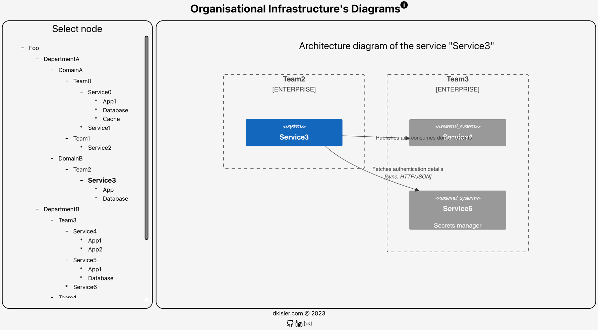

# Architecture diagrams with dynamically-adjustable level of details

The tool to facilitate understanding of complex systems using C4 model diagrams with dynamically-adjustable
level of details.

## Transitions

The contextual topology is illustrated below.

```commandline
organisation
|-- department 0
|   |-- domain 0.0
|   |   |-- team 0.0.0
|   |   |   |-- system 0.0.0
|   |   |   |   |-- container 0.0.0
|   |   |   |   |-- container 0.0.1
|   |   |   |   |   ...
|   |   |   |   `-- container 0.0.P
|   |   |   |-- system 0.0.1
|   |   |   |   ...
|   |   |   `-- system 0.0.L
|   |   |-- team 0.0.1
|   |   |   ...
|   |   `-- team 0.0.K
|   |-- domain 0.1
|   |   ...
|   `-- domain 0.M
|-- department 1
|   ...
`-- department N
```

The context transitions from the _organisation_ level down to the _system_ level. The diagram of every level includes the
nodes which belong to selected level's node and the linked nodes from other levels. 

### Example

**GIVEN**

- The organisation _Foo_ contains of two departments: _DepartmentA_ and _DepartmentB_.
- The _DepartmentA_ has two domains: _DomainA_ and _DomainB_.
- The _DomainA_ consists of three teams: _Team0_ (backend), _Team1_ (frontend).
- The _DomainB_ has one team: _Team2_ (analytics and reconciliation).
- The _DepartmentB_ has two teams: _Team3_ (streaming platform) and _Team4_ (CIAM).
- The _Team0_ has one outbound dependency: _Team1_, and two inbound dependencies: _Team3_ and _Team4_. 
- The _Team1_ has two inbound dependencies: _Team0_ and _Team4_.
- The _Team2_ has one dependency: _Team3_.
- The _Team3_ has three dependencies: _Team0_, _Team2_ and _Team4_.
- The _Team4_ has three outbound dependencies: _Team0_, _Team1_ and _Team3_, and one inbound dependency: _Team3_.
- The _Team0_ owns two services: _Service0_ and _Service1_.
- The _Team1_ owns one service: _Service2_.
- The _Team2_ owns one service: _Service3_.
- The _Team3_ owns three services: _Service4_, _Service5_ and _Service6_.
- The _Team4_ owns three services: _Service7_, _Service8_ and _Service9_.
- _Service0_ consists of three containers:
  - _App1_: _Kotlin_ application deployed as AWS EKS;
  - _Database_: AWS Aurora Postgres.
  - _Cache_: AWS Elasticache Redis.
- _Service1_ is a _Kotlin_ application to run batch jobs on database.
- _Service2_ is a _JavaScript_ application deployed to AWS EKS.
- _Service3_ consists of two containers:
  - _App_: _Python_ batch processing app deployed to AWS EKS;
  - _Database_: analytics db AWS Redshift.
- _Service4_ consists of three containers:
  - _App1_: _Kafka_ deployed as AWS MSK; 
  - _App2_: _Schema Registry_ deployed as _AWS Glue Schema Registry_;
- _Service5_ consists of three containers:
  - _App1_: Go application to sync domain events data to datalake deployed to AWS EKS;
  - _Database_: S3 bucket.
- _Service6_: secrets manager deployed as AWS Secretsmanager.
- _Service7_: is a Go application to mutate user's account deployed to AWS EKS;
- _Service8_ consists of four containers:
  - _IAM_: AWS Cognito;
  - _l0_: Go application deployed as AWS Lambda for AWS Cognito trigger 1;
  - _l1_: Go application deployed as AWS Lambda for AWS Cognito trigger 2;
  - _l2_: Go application deployed as AWS Lambda for AWS Cognito trigger 3;
- _Service9_ is AWS SES used as the email notification service.

#### Test Scenario - Domain Level

**WHEN**

- _Domain_ context level is set
- _DomainA_ is selected

**THEN**

The following diagram is expected.

```mermaid 
C4Context

Enterprise_Boundary(foo, "Organisation Foo") {
  Enterprise_Boundary(departmentA, "Department A") {
      Enterprise_Boundary(domainA, "Domain A") {
          Component(team0, "Team 0")
          Component(team1, "Team 1")
      }
  }
  Enterprise_Boundary(departmentB, "Department B") {
      Component_Ext(team3, "Team 3")
      Component_Ext(team4, "Team 4")
  }
}
Rel(team1, team0, "")
Rel(team0, team4, "")
Rel(team0, team3, "")
Rel(team1, team4, "")
```

```mermaid
C4Context
Enterprise_Boundary(Foo.DepartmentA, "DepartmentA") {
Enterprise_Boundary(Foo.DepartmentA.DomainA, "DomainA") {
Component(Foo.DepartmentA.DomainA.Team0, "Team0")
Component_Ext(Foo.DepartmentA.DomainA.Team1, "Team1")
}
}
Enterprise_Boundary(Foo.DepartmentB, "DepartmentB") {
Component_Ext(Foo.DepartmentB.Team3, "Team3")
Component_Ext(Foo.DepartmentB.Team4, "Team4")
}
Rel(Foo.DepartmentA.DomainA.Team0,Foo.DepartmentB.Team3,"")
Rel(Foo.DepartmentA.DomainA.Team0,Foo.DepartmentB.Team4,"")
Rel(Foo.DepartmentA.DomainA.Team1,Foo.DepartmentA.DomainA.Team0,"")
```

#### Test Scenario - Container Level

**WHEN**

- _Application_ context level is set
- _WebClient Application_ is selected

**THEN**

The following diagram is expected.

```mermaid
C4Context

Enterprise_Boundary(team1, "Team 1") {
    Container(team1.app, "WebClient", "JavaScript/AWS EKS")
}
Enterprise_Boundary(team0, "Team 0") {
    Container_Ext(team0.app, "Backend", "Kotlin/AWS EKS")
}
Enterprise_Boundary(team4, "Team 4") {
    Container_Ext(iam, "CIAM", "AWS Cognito")
}
Rel(team1.app, team0.app, "")
Rel(team1.app, iam, "")
```

## Demo

The screenshot illustrates the tool in action by visualising the infrastructure defined in the [file](src/data.json). 


